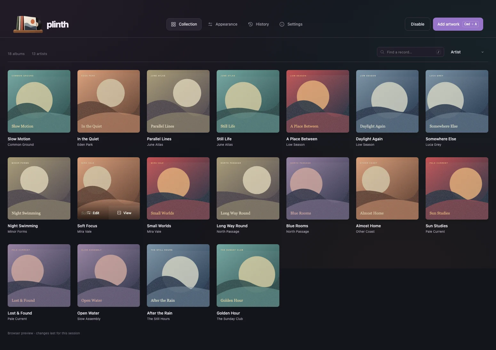
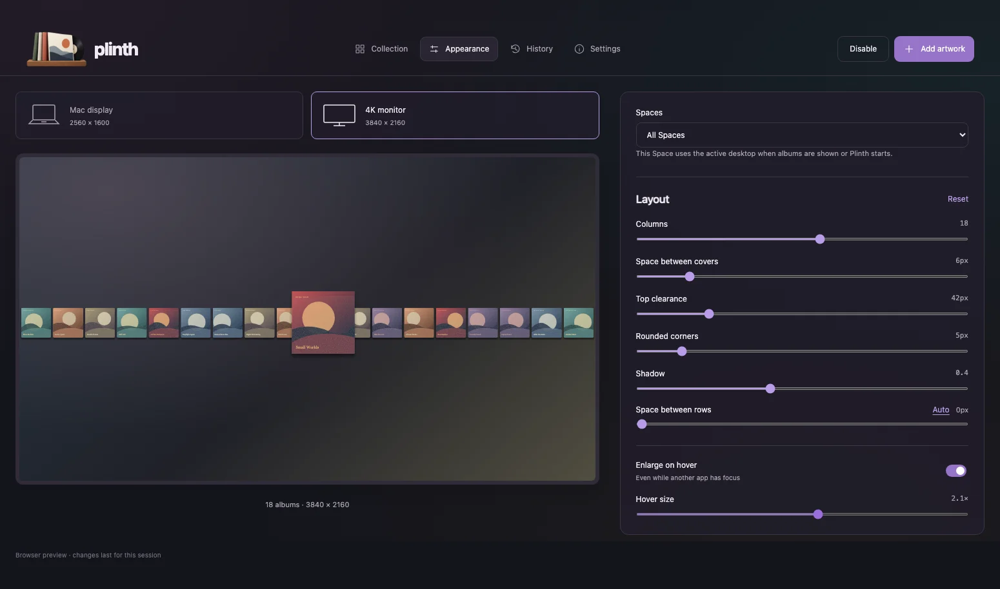
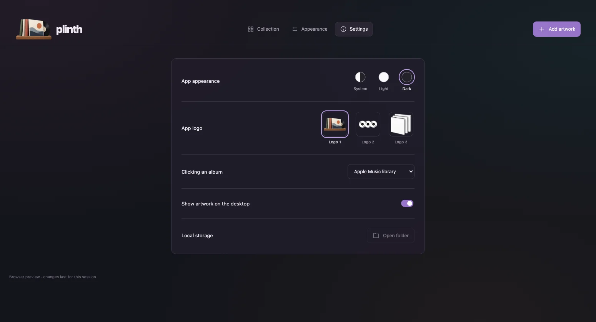
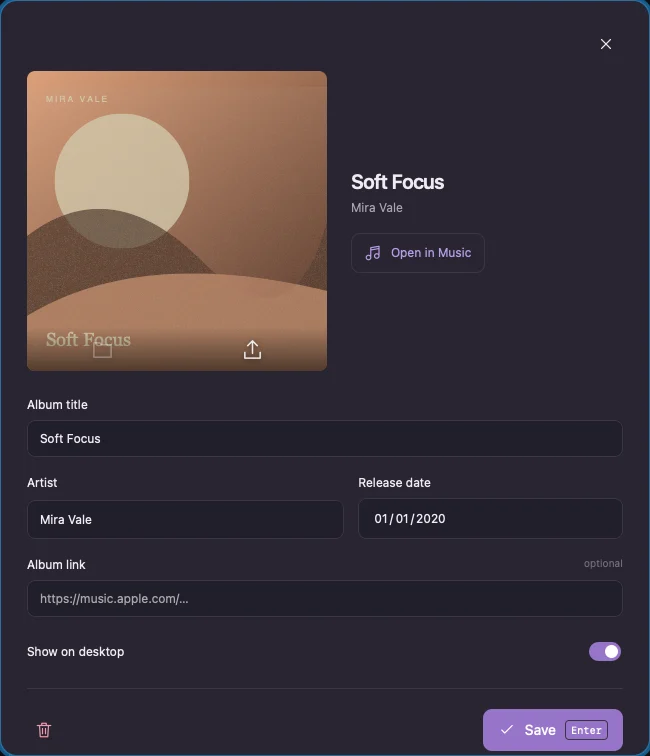

# Plinth

**Your records, on your desktop.**

Plinth is a macOS menu bar app that turns your album artwork into an interactive desktop collection. Add images, arrange your covers, and open a record in Music—all from one app. Built fresh with **Tauri 2, Svelte 5, and Rust**, with an interface inspired by Trilly.



## What it does

- **Drop artwork in.** Import individual images. Plinth preserves originals, creates optimized JPEGs up to 1200 px, and skips exact duplicates. PNG, JPEG, WebP, GIF (first frame), TIFF, and BMP are supported.
- **Make it yours.** Change columns, spacing, top clearance, corner radius, shadow, opacity, hover size, and ordering in the UI. Sort by artist, title, newest date, oldest date, or shuffle; choosing Shuffled again creates a new order. Choose a Mac display or 4K monitor preview with a separate layout for each. Appearance selects the display containing the Plinth window and uses detected pixel dimensions and scaling. The Mac preview identifies the built-in panel, even when another display is primary. If macOS hides that panel with the lid closed, Plinth uses its last detected dimensions; before the first detection, it shows “Not detected.”
- **Keep your music close.** Click a desktop cover to reveal its album in Apple Music, or open its saved HTTPS link. Edit titles, artists, release dates, links, and desktop visibility in the collection. The editor shows large original artwork, with download and replace controls that fade in on hover; drop a single image onto it to replace it. The collection and desktop use optimized copies.
- **Hover without switching apps.** Hold the Hover size slider to preview a randomly selected album at the chosen enlargement; release to return it to normal. Native macOS pointer tracking enlarges covers over exposed desktop areas while another app retains focus. Covers stay behind normal windows; moving over another window clears the hover.
- **Stay in the menu bar.** Plinth appears in the Dock while its window is open. Closing the window or pressing Command-W hides it and keeps the desktop running. Command-Q opens a dialog with Cancel (Escape), Hide window (Command-W) in the middle, and Quit Plinth (Command-Q). No action is selected by default; Return does nothing until you focus a button. Left-click the menu bar icon to open Plinth. Right-click for Open Plinth, Hide desktop / Show desktop, and Quit Plinth.
- **Keep everything local.** No account, cloud service, analytics, or encryption setup. The production app does not run an HTTP server or depend on Plash or Python.







The screenshots contain only synthetic artwork and fictional album metadata. No personal music collection is included in this repository.

## Use it

Launch `Plinth.app`, choose **Add artwork**, or drop image files into the library window. Imported records can be edited by clicking their artwork. Choose **Appearance** to adjust the desktop, and **Settings** for the app theme, logo, and Music behavior. **App logo** offers the three supplied designs and remembers your choice. Switching updates the app header, browser icon, macOS Dock, menu bar, and Finder app icon.

Missing albums show a native macOS alert. The first Music action may ask for macOS Automation permission. Library mode searches album titles in your local Music library; link mode opens the URL you saved. No Apple Music API credentials are needed.

The Collection page and desktop album list do not scroll. Albums beyond the visible area are clipped; use Collection search to find a specific record. Appearance controls and album editors remain scrollable when needed.

The desktop is a transparent native window above the wallpaper and desktop icons, below ordinary windows. It receives clicks and does not scroll. Incomplete rows are centered; use the Columns setting to fit more covers on screen. Covers enlarge without activating Plinth; this does not draw over your foreground apps. Restart Plinth after changing monitor arrangements. Add Plinth in **System Settings → General → Login Items** if you want it to start at login.

Option-Q and Option-W move to the previous or next page, wrapping at either end. Window size is remembered when you close or quit; new installations open at 1550 × 840 points.

## Local data and backups

On macOS, data is stored under:

```text
~/Library/Application Support/com.plinth.desktop/
  library.json           # Album metadata and appearance settings
  library.previous.json  # Previous saved database
  window.json            # Remembered main-window size
  internal-display.json  # Last detected built-in panel dimensions
  originals/             # Unmodified imported images
  covers/                # Optimized desktop JPEGs
```

Use **Settings → Local storage → Open folder** to find it. Back up the entire folder. Removing an album removes it from the collection but retains its stored image files. Imports copy files; they never move or delete the source images.

Existing Desktop Album Art filenames such as `Artist - Album (2025-04-03) =album=album-slug=123.png` are understood automatically. Ordinary filenames also work; fill in their metadata in the editor.

For one-time migration, while Plinth is closed:

```sh
/path/to/Plinth.app/Contents/MacOS/plinth --import /path/to/artwork.png
```

The command optionally accepts `--settings /path/to/settings.json`. Personal paths, collections, and migration settings do not belong in Git.

## Development

Requires macOS 13+, Xcode Command Line Tools, Rust, Node 22.12+ (or a compatible newer release), and pnpm.

```sh
pnpm install --frozen-lockfile
pnpm dev           # Native Tauri app with Vite
pnpm dev:web       # Browser UI, without native integration
pnpm check
pnpm test:native
pnpm test
pnpm build:app     # Produces src-tauri/target/release/bundle/macos/Plinth.app
```

The permanent development port is **23983**, selected once with a cryptographically secure random generator and recorded in `port.json`. There is no production server port. Browser mode starts with an empty, temporary library. `?demo=1` enables fictional sample records; browser changes last only for that session.

Run `pnpm screenshots` after any UI change to refresh the README WebPs. Tests use isolated browser contexts and temporary native fixture directories, never the real library. The hover animation matches the previous app’s jQuery swing curve: 250 ms in and 251 ms out. The native hover behavior also needs a macOS smoke test because a browser cannot reproduce desktop window ordering.

Work on a task branch in a separate Git worktree, verify it, merge into `main`, and push. See [AGENTS.md](AGENTS.md).

## Status and credits

This is the first local macOS build. Distribution signing, notarization, automatic updates, automatic display hot-plug handling, and a packaged Windows/Linux desktop implementation are not included. Transparent macOS webviews use Tauri’s `macos-private-api` feature; this build targets direct local installation.

Inspired by [Plash](https://github.com/sindresorhus/Plash) and Desktop Album Art. Plash’s preserved MIT-licensed source informed the native desktop window behavior; its notice is retained in [THIRD_PARTY_NOTICES.md](THIRD_PARTY_NOTICES.md). Trilly inspired the UI’s typography, iridescent palette, and controls. No Plash telemetry, service credentials, or app identity is reused.

On macOS, `pnpm run dev` launches the Cargo executable from a generated `PlinthDev.app` in the build directory, with Plinth’s Dock icon and bundle metadata. The runner preserves hot reload and terminal output. The bundle is a build artifact and is never installed automatically.

Logo source artwork lives in `assets/logos/`. Run `pnpm icons` on macOS to regenerate the browser, menu bar, and packaged app icons. Logo 1 is the default for new installs and older settings. Logo 2 has transparent background and grooves, with black record centers.
