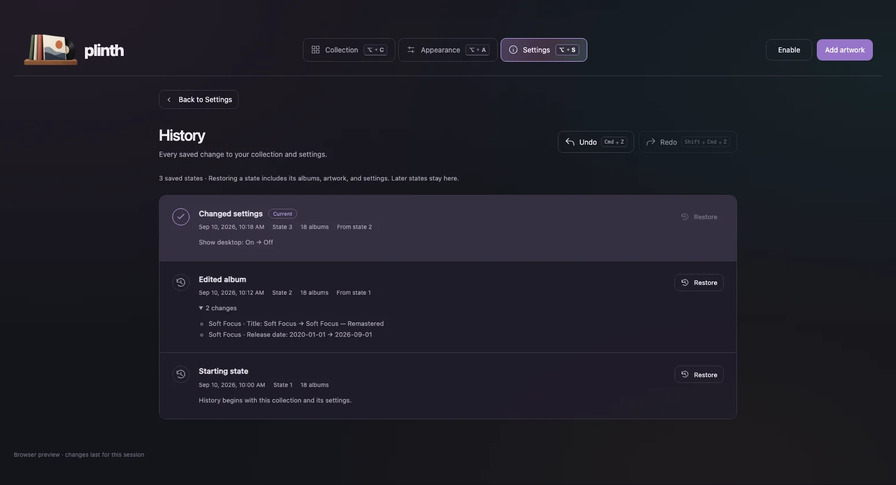

# Plinth

**Your records, on your desktop.**

Plinth is a macOS menu bar app that turns your album artwork into an interactive desktop collection. Add images, arrange your covers, and open a record in Music—all from one app. Built fresh with **Tauri 2, Svelte 5, and Rust**, with an interface inspired by Trilly.


## What it does

- **Drop artwork in.** Import individual images. Plinth preserves originals, creates optimized JPEGs up to 1200 px, and skips exact duplicates. PNG, JPEG, WebP, GIF (first frame), TIFF, and BMP are supported.
- **Make it yours.** Change columns, spacing, top clearance, corner radius, shadow, hover size, and ordering in the UI. Sort by artist, title, newest date, oldest date, or shuffle; choosing Shuffled again creates a new order. Choose a Mac display or 4K monitor preview with a separate layout for each. Appearance selects the display containing the Plinth window and uses detected pixel dimensions and scaling. The Mac preview identifies the built-in panel, even when another display is primary. If macOS hides that panel with the lid closed, Plinth uses its last detected dimensions; before a verified detection with the panel awake and mirroring off, it shows “Not detected.” Older unverified display caches are ignored.
- **Keep your music close.** Click a desktop cover to reveal its album in Apple Music, or open its saved Apple Music HTTPS link. Edit titles, artists, release dates, links, and desktop visibility in the collection. The editor shows large original artwork, with Finder and upload controls that fade in on hover; drop a single image onto it to replace it. Click the artwork to view it nearly full screen, then click anywhere, including the artwork, or press Escape to return to the editor. The folder button reveals the original in Finder; the upload button replaces it. Open in Music has a padded button, and Save also responds to Enter anywhere in the editor. The collection and desktop use optimized copies.
- **Hover without switching apps.** Hover speed shows the enlargement duration in milliseconds (83–1000 ms, default 250 ms); lower values animate faster, and shrinking uses the same timing ratio, with rounded corners animating alongside the size. Hold the Hover size slider to preview a randomly selected album at the chosen enlargement; release to return it to normal. Native macOS pointer tracking enlarges covers over exposed desktop areas while another app retains focus. Turn off **While another app has focus**, beneath **Enlarge on hover**, to limit enlargement to when Plinth or Finder is active. Covers stay behind normal windows; moving over another window clears the hover.
- **Stay in the menu bar.** Plinth appears in the Dock while its window is open. Closing the window or pressing Command-W hides it and keeps the desktop running. Command-Q opens a dialog with Cancel (Escape), Hide window (Command-W) in the middle, and Quit Plinth (Command-Q). No action is selected by default; Return does nothing until you focus a button. Left-click the menu bar icon to open Plinth. Right-click for Open Plinth, Hide desktop / Show desktop, and Quit Plinth.
- **Revisit every saved change.** Open History from Settings → History. Undo with Command-Z, redo with Shift-Command-Z, or restore any listed state. Imports, removals, metadata, artwork replacements, appearance, and app settings are included. Each entry shows when it was saved and what changed. New edits after undo keep the abandoned states available to restore. Text fields keep their normal text undo.
- **Keep everything local.** No account, cloud service, analytics, or encryption setup. The production app does not run an HTTP server or depend on Plash or Python.





The screenshots contain only synthetic artwork and fictional album metadata. No personal music collection is included in this repository.

## Use it

Launch `Plinth.app`, choose **Add artwork**, or drop image files into the library window. The Enable / Disable button beside Add artwork controls desktop artwork from any page and keeps the window focused. Press Command-A on the Collection page to add artwork. Click a record’s artwork, caption, or caption spacing to edit it. From the editor, click the artwork to view the original in the borderless gallery. Enter a **Playlist** name to make the record open that playlist from your Music library, including private playlists, instead of the album. Choose **Appearance** to adjust the desktop using lightweight white placeholders with the same album count, layout, and hover behavior, and **Settings** for the app theme, logo, and Music behavior. **App logo** offers the three supplied designs and remembers your choice. Switching updates the app header, browser icon, macOS Dock, menu bar, and Finder app icon.

**Appearance → Spaces** has buttons for **All Spaces**, **This Space**, **1**, **2**, and **3**. All Spaces shows artwork everywhere. This Space uses the active desktop when artwork is enabled or Plinth starts. Numbered choices place artwork directly on that Mission Control desktop without switching Spaces or moving the main window. The number is remembered across launches and follows Mission Control's desktop order, excluding full-screen apps. With separate Spaces per display, artwork appears on the display that owns the chosen desktop. Missing numbered desktops are disabled; create them in Mission Control, then return to Appearance. If a saved desktop no longer exists, choose another option.

Album clicks automatically open a saved HTTPS Apple Music link (`music.apple.com`) directly in the Music app, or look up the album by title and artist in your local Music library otherwise. Missing albums show a native macOS alert. The first library lookup may ask for macOS Automation permission. No Apple Music API credentials are needed.

### Links to your Music library

Plinth handles `plinth://` links on macOS. Use these anywhere that supports custom app links:

```text
plinth://playlist/Evening%20records
plinth://album/Glass%20Gardens?artist=North%20Arc
plinth://artist/North%20Arc
```

The pattern is `plinth://playlist/NAME`, `plinth://album/TITLE?artist=NAME`, or `plinth://artist/NAME`. Names match your local Music library, including private playlists and imported music. The album artist option is optional; include it to distinguish albums with the same title. These links reveal music without starting playback, adding anything to the library, or opening the streaming catalog. Albums match the exact title and, when supplied, artist or album artist. With duplicate exact names, Music opens the first matching item. Playlist lookup explicitly searches local library sources (including playlists in folders) and waits briefly for Music to load on a cold launch. It prefers the exact spelling, then tolerates capitalization, Unicode composition, and invisible spacing differences only when that leaves one matching playlist; ambiguous normalized names show an alert.

Replace spaces with `%20`. Encode special characters inside names too: `/` → `%2F`, `?` → `%3F`, `#` → `%23`, `&` → `%26`, `%` → `%25`. Names may include Unicode. Playlist and artist links take no query options; album links accept only one `artist` option. Invalid destinations, credentials, ports, fragments, malformed encoding, control characters, and oversized names are rejected. Overlapping link requests are ignored while Music navigation is in progress.

The handler runs only bundled AppleScripts using `/usr/bin/osascript`, passing decoded names as arguments, never executable code. It cannot invoke a link-supplied command, load a file, import artwork, run an installer, or forward a URL to another app. Missing library items show Music’s native alert. Automation permission is required. Artist navigation additionally uses the fixed **Song → Show Artist in Library** menu action and requires Accessibility permission and an English Music interface; if unavailable it fails rather than opening a catalog page.

Build the updated app (`pnpm build:app`) and install its bundle before using these links. macOS reads the `plinth` scheme registration from the app’s Info.plist. The generated development bundle includes the same registration; the installed live development app refreshes and registers its protocol metadata on each rebuild. Link handling uses Tauri’s native macOS [`RunEvent::Opened`](https://docs.rs/tauri/latest/tauri/enum.RunEvent.html#variant.Opened); it does not add a production server or a general-purpose URL opener.

Collection and History scroll to show every album and saved state. The desktop album list does not scroll; albums beyond its visible area are clipped. Appearance controls and album editors remain scrollable when needed.

Space between rows defaults to **Auto**, which balances the gap below the menu bar with the gap below the last row using each display’s size. A single row is centered vertically. Crowded layouts use zero spacing instead of overlapping; increase Columns if the albums cannot fit. The gap slider is disabled while Auto is checked; uncheck Auto to set a custom gap. Existing saved numeric spacing remains manual; check Auto or use Layout Reset to restore balanced spacing. Artwork opacity and surrounding-cover dimming are no longer applied.

The desktop is a transparent native window above the wallpaper and desktop icons, below ordinary windows. It receives clicks and does not scroll. Cover width and height use the same calculated size, so increasing cover spacing shrinks square covers. Incomplete rows are centered; use the Columns setting to fit more covers on screen. Covers enlarge without activating Plinth; this does not draw over your foreground apps. Restart Plinth after changing monitor arrangements. Add Plinth in **System Settings → General → Login Items** if you want it to start at login.

Alt-C, Alt-A, and Alt-S open Collection, Appearance, and Settings (use Option on Mac). The tab buttons show these shortcuts. Option-Q and Option-W move to the previous or next page, wrapping at either end. Window size is remembered when you close or quit; new installations open at 1550 × 840 points.

## Local data and backups

On macOS, data is stored under:

```text
~/Library/Application Support/com.plinth.desktop/
  library.json           # Current library, settings, and saved history
  library.previous.json  # Previous saved database
  window.json            # Remembered main-window size
  internal-display.json  # Last detected built-in panel dimensions
  originals/             # Unmodified imported images
  covers/                # Optimized desktop JPEGs
```

Use **Settings → Local storage → Open folder** to find it. Back up the entire folder. Removing an album removes it from the collection but retains its stored image files. Imports copy files; they never move or delete the source images.

History starts with your current collection when this version first opens; changes made before that cannot be reconstructed. History and the active state are saved together in `library.json` and survive restarts, including the undo/redo position. Snapshots reference retained artwork files, so keep the `originals/` and `covers/` directories with your backup. Restoring a state updates the desktop, app logo, and menu-bar visibility setting too. Unsaved editor text, temporary hover previews, page navigation, and window size are outside library history. Browser demo history lasts for the current session.

Existing Desktop Album Art filenames such as `Artist - Album (2025-04-03) =album=album-slug=123.png` are understood automatically. Ordinary filenames also work; fill in their metadata in the editor.

For one-time migration, while Plinth is closed:

```sh
/path/to/Plinth.app/Contents/MacOS/plinth --import /path/to/artwork.png
```

The command optionally accepts `--settings /path/to/settings.json`. Personal paths, collections, and migration settings do not belong in Git.

## Development

Requires macOS 13+, Xcode Command Line Tools, Rust, Node 22.12+ (or a compatible newer release), and pnpm.

```sh
pnpm install --frozen-lockfile
pnpm dev           # Native Tauri app with Vite
pnpm dev:daemon    # Install/start the always-on live development app
pnpm dev:web       # Browser UI, without native integration
pnpm check
pnpm test:native
pnpm test:music   # Headless AppleScript playlist-name matching
pnpm test
pnpm build:app     # Produces src-tauri/target/release/bundle/macos/Plinth.app
```

The permanent development port is **23983**, selected once with a cryptographically secure random generator and recorded in `port.json`. There is no production server port. Browser mode starts with an empty, temporary library. `?demo=1` enables fictional sample records; browser changes last only for that session.

`pnpm dev:daemon` builds a debug `Plinth.app` in `~/Applications`, registers it as a per-user LaunchAgent, and keeps `pnpm tauri dev` running across logins and unexpected exits. Frontend changes hot-reload, while Rust changes rebuild and restart the executable inside the installed app container. Logs are written to `~/Library/Logs/Plinth`. Re-run the installer only after moving the repository or changing the daemon scripts. Stop it and move its installed files to the Trash with `pnpm dev:daemon:stop`.

Daemon builds use a Developer ID Application certificate from the login keychain so macOS sees each rebuild as the same app. The first install saves the chosen certificate fingerprint in `~/Library/Application Support/Plinth/dev-signing-identity`. If more than one certificate is available, run the installer with `PLINTH_SIGNING_IDENTITY` set to the desired SHA-1 fingerprint from `security find-identity -v -p codesigning`.

Appearance performance measurements for 150 visible albums in the development build, including rejected experiments and every test result, are recorded in [the preview performance report](experiments/preview/results/README.md).

Run `pnpm screenshots` after any UI change to refresh the README WebPs. Tests use isolated browser contexts and temporary native fixture directories, never the real library. The hover animation matches the previous app’s jQuery swing curve: 250 ms in and 251 ms out. The native hover behavior also needs a macOS smoke test because a browser cannot reproduce desktop window ordering. Run `cargo run --manifest-path src-tauri/Cargo.toml --example desktop-focus` to check repeated enable/disable with an isolated, invisible editor window; it restores the previously focused app afterward and never opens the library. Run `cargo run --manifest-path src-tauri/Cargo.toml --example space-placement` to verify numbered placement using invisible temporary windows, without opening the library. Numbered placement uses dynamically loaded macOS APIs and verifies the resulting Space membership; existing desktop windows are retained if a replacement cannot be placed.

Work on a task branch in a separate Git worktree, verify it, merge into `main`, and push. See [AGENTS.md](AGENTS.md).

## Status and credits

This is the first local macOS build. Distribution signing, notarization, automatic updates, automatic display hot-plug handling, and a packaged Windows/Linux desktop implementation are not included. Transparent macOS webviews use Tauri’s `macos-private-api` feature; this build targets direct local installation.

Inspired by [Plash](https://github.com/sindresorhus/Plash) and Desktop Album Art. Plash’s preserved MIT-licensed source informed the native desktop window behavior; its notice is retained in [THIRD_PARTY_NOTICES.md](THIRD_PARTY_NOTICES.md). Trilly inspired the UI’s typography, iridescent palette, and controls. No Plash telemetry, service credentials, or app identity is reused.

On macOS, `pnpm run dev` launches the Cargo executable from a generated `PlinthDev.app` in the build directory, with Plinth’s Dock icon and bundle metadata. The runner preserves hot reload and terminal output. The bundle is a build artifact and is never installed automatically.

Logo source artwork lives in `assets/logos/`. Run `pnpm icons` on macOS to regenerate the browser, menu bar, and packaged app icons. Logo 1 is the default for new installs and older settings. Logo 2 has transparent background and grooves, with black record centers.
